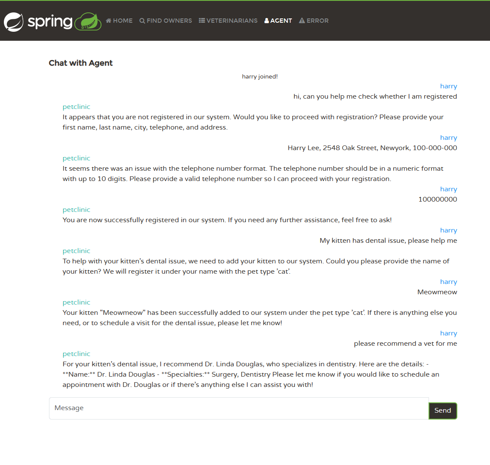

# Spring PetClinic With OpenAI and Langchain4j - Launch Your First AI app on Azure Spring Apps

## Quick Start

The sample project is an AI application that uses Azure Spring Apps and Azure Open AI. The application provides AI assitant functionality in a Spring Pet Clinic application.

You can smoothly get help by having a natural language chat with the AI assistant. The AI assistant can assist you with the following tasks:
1. Querying the registered pet owners
2. Adding a new pet owner
3. Updating the pet owner's information
4. Adding a new pet
5. Querying the vets' information

Please follow [Launch the first AI app on Azure Spring Apps](https://learn.microsoft.com/azure/spring-apps/enterprise/quickstart-deploy-ai-app) to deploy the application to Azure Spring Apps.

## The Sequence workflow of langchain4j

## Understanding the Spring Petclinic application with a few diagrams

[See the presentation here](https://speakerdeck.com/michaelisvy/spring-petclinic-sample-application)

## Workthrough of the chat agent
You can talk with the agent, it can help to recommend the vet according to the symptoms of the pet. The agent can also help to book an appointment with the vet.

Go to the owner page, you can see you are registered as an owner with the help of the agent

## LLM Progamming
Normally a LLM application contains 5 parts: Prompt, Model, Memory, Native Functions (tools）and RAG (content retriever)

### Prompt
The prompt is defined in [agent](https://github.com/showpune/spring-petclinic-langchain4j/blob/master/src/main/java/org/springframework/samples/petclinic/chat/Agent.java)

### Model
The model is is defined in [model](https://github.com/showpune/spring-petclinic-langchain4j/blob/3d2dcc1c303a7352f681892bb0871dbea1daaebd/src/main/java/org/springframework/samples/petclinic/chat/AgentConfig.java#L36), the model can be used for [chat](https://github.com/showpune/spring-petclinic-langchain4j/blob/3d2dcc1c303a7352f681892bb0871dbea1daaebd/src/main/java/org/springframework/samples/petclinic/chat/AgentConfig.java#L26), or can be used for [content augmentor](https://github.com/showpune/spring-petclinic-langchain4j/blob/3d2dcc1c303a7352f681892bb0871dbea1daaebd/src/main/java/org/springframework/samples/petclinic/chat/AgentConfig.java#L50)

### Memory
Memory Store: The demo still use the local memory defined in [memory store](https://github.com/showpune/spring-petclinic-langchain4j/blob/c95a598f4fdaf68a3f331b32ca42ef5ef95e5c17/src/main/java/org/springframework/samples/petclinic/chat/LocalConfig.java#L39), it means it can not share memory between instances, you can enhance it use memory on Redis

Memory ID: It use the username as memory id [Memory ID](https://github.com/showpune/spring-petclinic-langchain4j/blob/c95a598f4fdaf68a3f331b32ca42ef5ef95e5c17/src/main/java/org/springframework/samples/petclinic/chat/Agent.java#L13)

### Interact with natives functions
The Demo provided two local tools to interactive with native functions
1) [Vets and their specialist](https://github.com/showpune/spring-petclinic-langchain4j/blob/c95a598f4fdaf68a3f331b32ca42ef5ef95e5c17/src/main/java/org/springframework/samples/petclinic/chat/VetTools.java#L41): The agent will know the system can return list of Vets, include their specialist, it can be used to recommend a vet
2) [Owner and Pets](https://github.com/showpune/spring-petclinic-langchain4j/blob/master/src/main/java/org/springframework/samples/petclinic/chat/OwnerTools.java): he agent will know the system register new owner and their pets

### Content Retriever
It still use the local file as [content retriever](https://github.com/showpune/spring-petclinic-langchain4j/blob/c95a598f4fdaf68a3f331b32ca42ef5ef95e5c17/src/main/java/org/springframework/samples/petclinic/chat/LocalConfig.java#L51), it provided the guideline how the agent should work, which is in [Term of Use](https://github.com/showpune/spring-petclinic-langchain4j/blob/master/src/main/resources/petclinic-terms-of-use.txt), the content is ingest when the store in initialized [here](https://github.com/showpune/spring-petclinic-langchain4j/blob/d95e8c0bd9b5eb42da38b991ac50b854a61ad42e/src/main/java/org/springframework/samples/petclinic/chat/LocalConfig.java#L78). If you have lots of content, tried to use the [AI Search](https://github.com/langchain4j/langchain4j-spring/tree/main/langchain4j-azure-ai-search-spring-boot-starter) to create the RAG

### Talk with Other language
You can also talk with the agent with your own language, like Chinese

The problem is that your [Term of Use](https://github.com/showpune/spring-petclinic-langchain4j/blob/master/src/main/resources/petclinic-terms-of-use.txt) is in English, the traditional way is that provide a localized term of use for each language, but you can use openAI to make it easier

We can define a [Retrieval Augmentor](https://github.com/showpune/spring-petclinic-langchain4j/blob/c95a598f4fdaf68a3f331b32ca42ef5ef95e5c17/src/main/java/org/springframework/samples/petclinic/chat/AgentConfig.java#L47C21-L47C39), and translate your ask into English before you retrieve the content